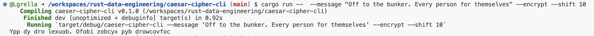
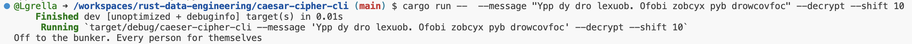
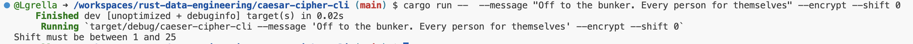

[](https://github.com/nogibjj/rust-data-engineering/actions/workflows/lint.yml)
[](https://github.com/nogibjj/rust-data-engineering/actions/workflows/tests.yml)


# Rust Data Engineering: Modifying the Command-Line Tool for the Caesar Cipher 

### Lab:  Modifying a Rust Command-Line Tool

In this lab you will gain experience extending an existing Rust project by forking and modifying a simple command-line tool.

**Steps**

1. Fork the repository at **https://github.com/nogibjj/rust-data-engineering**

2. Clone your forked repository 

3. Navigate to one of the command-line tool projects

4. Make a small modification to the tool such as:

   - Adding a new command line argument
    
   - Supporting additional input file formats
    
   - Adding more processing logic
    
   - Changing output formatting

5. Run `cargo build` to compile your changes  

6. Run `cargo run` to test your modified tool

7. Commit your changes and push to your forked repository


**Deliverable**

Submit a link to your forked repository showing the code changes.

## Project Overview

I chose to edit the Caesar Cipher CLI tool as I felt the error catching for the user input for that command line tool could be improved. 
Prior to my edits, the program only instructed the user if they didn't specify encrypt or decrypt. I felt as though the shift command needed further error catching. 

In the program, it is specified that the shift should only be between 1 and 25; however, there was nothing stopping the user from inputting a value outside of this range. 

I added the following code to the main function to prevent this from happening. It also provides the user with some additional feedback.

```rust
if args.shift < 1 || args.shift > 25 {
	println!("Shift must be between 1 and 25");
	return;
}   
```

# Process for running the code:
1. Open codespaces on this repository
2. navigate to the caesar-cipher-cli folder (terminal command: cd caesar-cipher-cli)
3. Interact within the terminal to encrypt or decrypt a message.

# How to Run: 

**Encrypt:**
```
cargo run --  --message "Off to the bunker. Every person for themselves" --encrypt --shift 10
```
Example of Encrypt:



**Decrypt:**
```
cargo run --  --message "Ypp dy dro lexuob. Ofobi zobcyx pyb drowcovfoc" --decrypt --shift 10
```
Example of Decrypt:



Example of Output when Shift = 0:



## Technical Notes

**Makefile**

Each subdirectory project uses this style to make it easy to test and run

```
format:
	cargo fmt --quiet

lint:
	cargo clippy --quiet

test:
	cargo test --quiet

run:
	cargo run 

all: format lint test run
```


## References

* [Rust Collections](https://doc.rust-lang.org/std/collections/index.html)
* [GitHub Copilot CLI](https://www.npmjs.com/package/@githubnext/github-copilot-cli)
* [Rust Fundamentals](https://github.com/alfredodeza/rust-fundamentals)
* [Rust Tutorial](https://nogibjj.github.io/rust-tutorial/)
* [Rust MLOps Template](https://github.com/nogibjj/mlops-template)
